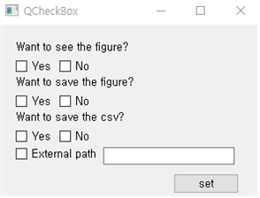

# Introduction
PE2-Project

A1 김동구, 김민재, 박찬근

* Our program was developed for data analysis.
    * Data fitting visualization
    * Result file(dataframe.csv , Image file)

# Installation
1. This program requires several libraries.(Basically, interpreter anaconda or miniconda is needed.)
    * So, enter the ***'Terminal'*** and type as follows.
    * ***pip install -r requirements.txt***
    * This command will install all necessary libraries.
2. The 'src' folder must be specified as the sources root.
    * Right-click on the src folder on the left
    * Go to Mark directory as and select sources root.
3. Now the program is ready to use.

# How to make it work
***When you run the program, all files in the result folder are deleted, so make sure to back up if they are important.***
1. Run the run.py it appears that these checkbox.

2. Select the desired option and click the set button to launch the program.
    * At this point, enter the path in the textbox where the data file is in the outer path, and leave it blank if not.

# After running
1. Click on the link below to check the report.

[report](https://github.com/PE2-Project/project/blob/main/doc/report.ipynb)
